<div align="center">

# Chiikawa Dots Pets

**치이카와 친구들 11명을 Codex 데스크톱 펫으로**

[한국어](README.md) · [English](README.en.md) · [日本語](README.ja.md)


[고화질 영상 보기 (MP4 · 1080p · 100fps)](assets/promo-ko.mp4) · [릴리즈 다운로드](https://github.com/heelee912/chiikawa-dots-pets/releases/latest)

</div>

---

치이카와 친구들 **11명**을 Codex 데스크톱 앱의 펫으로 데려올 수 있습니다.
모든 펫은 **Codex 펫 v2 규격**(8열 × 11행 · 셀 192 × 208 · 1536 × 2288 투명 PNG)이고, 9가지 상태 모션과 16방향 시선을 갖추고 있습니다.

## 캐릭터

<table>
<tr><td align="center">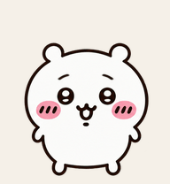<br><sub>치이카와<br><code>chiikawa</code></sub></td><td align="center">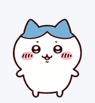<br><sub>하치와레<br><code>hachiware</code></sub></td><td align="center">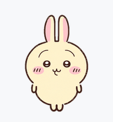<br><sub>우사기<br><code>usagi</code></sub></td><td align="center">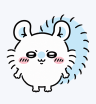<br><sub>모몽가<br><code>momonga</code></sub></td><td align="center">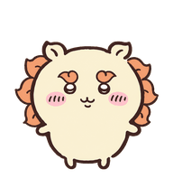<br><sub>시사<br><code>shisa</code></sub></td><td align="center">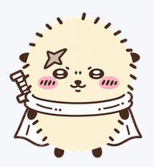<br><sub>랏코<br><code>rakko</code></sub></td></tr>
<tr><td align="center"><br><sub>쿠리만주<br><code>kurimanju</code></sub></td><td align="center"><br><sub>세이렌<br><code>siren</code></sub></td><td align="center">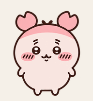<br><sub>후루혼야<br><code>furuhonya</code></sub></td><td align="center">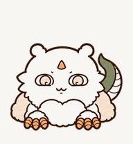<br><sub>아노코<br><code>anoko</code></sub></td><td align="center">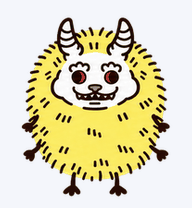<br><sub>데카츠요<br><code>dekatsuyo</code></sub></td></tr>
</table>

## 설치

### 한 줄 설치

**Windows (PowerShell)**

```powershell
irm https://raw.githubusercontent.com/heelee912/chiikawa-dots-pets/main/install.ps1 | iex
```

**macOS · Linux**

```bash
curl -fsSL https://raw.githubusercontent.com/heelee912/chiikawa-dots-pets/main/install.sh | sh
```

11명 모두 설치됩니다. 일부만 원하면 `CHIIKAWA_PETS` 환경 변수에 펫 ID를 적어 주세요. 설치 후 Codex를 다시 시작하고 펫 목록에서 고르면 됩니다.

```powershell
$env:CHIIKAWA_PETS = "chiikawa,momonga"; irm https://raw.githubusercontent.com/heelee912/chiikawa-dots-pets/main/install.ps1 | iex
```

### 직접 설치

[최신 릴리즈](https://github.com/heelee912/chiikawa-dots-pets/releases/latest)에서 zip을 내려받아 캐릭터 폴더(`pet.json` + `spritesheet.png`)를 `~/.codex/pets/` 아래에 넣으세요. Windows는 `%USERPROFILE%\.codex\pets\`입니다.

## 모션 갤러리

모든 모션은 승인된 원본 그대로이며 프레임마다 기록된 재생 시간을 지킵니다.

<table>
<tr><th></th><th><sub>쉬기</sub></th><th><sub>달리기 →</sub></th><th><sub>달리기 ←</sub></th><th><sub>인사</sub></th><th><sub>점프</sub></th><th><sub>실패</sub></th><th><sub>기다림</sub></th><th><sub>작업</sub></th><th><sub>검토</sub></th><th><sub>16방향</sub></th></tr>
<tr><th><sub>치이카와</sub></th><td></td><td>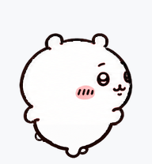</td><td>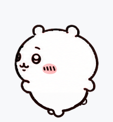</td><td>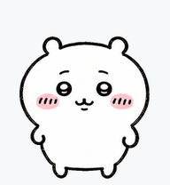</td><td>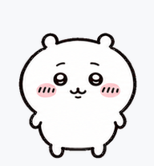</td><td>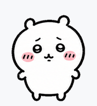</td><td>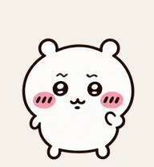</td><td>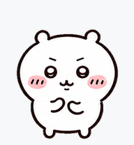</td><td>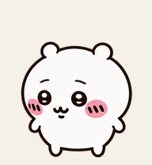</td><td>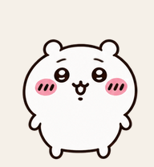</td></tr>
<tr><th><sub>하치와레</sub></th><td></td><td>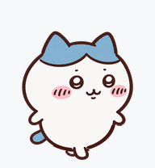</td><td>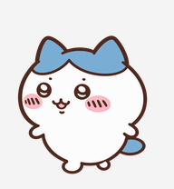</td><td>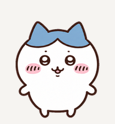</td><td>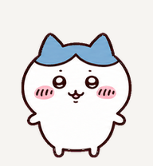</td><td>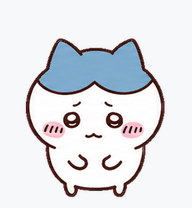</td><td>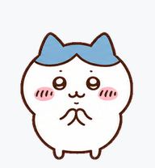</td><td>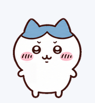</td><td>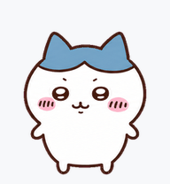</td><td>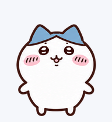</td></tr>
<tr><th><sub>우사기</sub></th><td></td><td>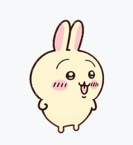</td><td>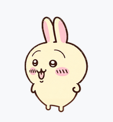</td><td>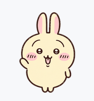</td><td>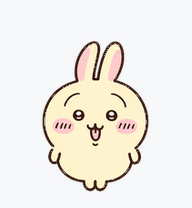</td><td>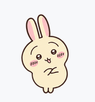</td><td>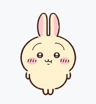</td><td>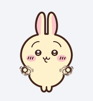</td><td>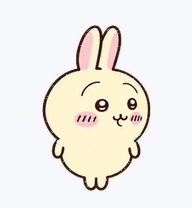</td><td>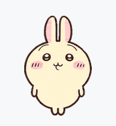</td></tr>
<tr><th><sub>모몽가</sub></th><td></td><td>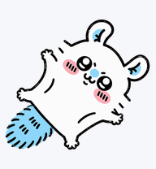</td><td>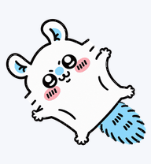</td><td>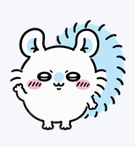</td><td>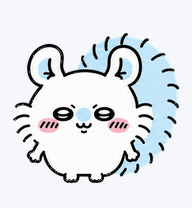</td><td>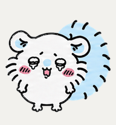</td><td>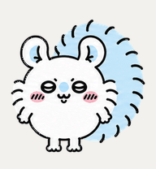</td><td>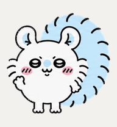</td><td>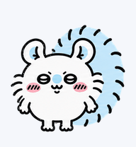</td><td>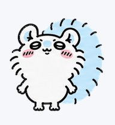</td></tr>
<tr><th><sub>시사</sub></th><td></td><td>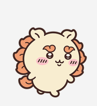</td><td>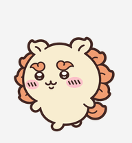</td><td>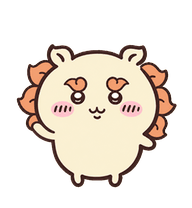</td><td>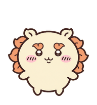</td><td>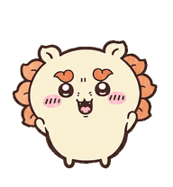</td><td></td><td></td><td></td><td></td></tr>
<tr><th><sub>랏코</sub></th><td></td><td></td><td></td><td></td><td></td><td></td><td></td><td></td><td></td><td></td></tr>
<tr><th><sub>쿠리만주</sub></th><td></td><td></td><td></td><td></td><td></td><td></td><td></td><td></td><td></td><td></td></tr>
<tr><th><sub>세이렌</sub></th><td></td><td></td><td></td><td></td><td></td><td></td><td></td><td></td><td></td><td></td></tr>
<tr><th><sub>후루혼야</sub></th><td></td><td></td><td></td><td></td><td></td><td></td><td></td><td></td><td></td><td></td></tr>
<tr><th><sub>아노코</sub></th><td></td><td></td><td></td><td></td><td></td><td></td><td></td><td></td><td></td><td></td></tr>
<tr><th><sub>데카츠요</sub></th><td></td><td></td><td></td><td></td><td></td><td></td><td></td><td></td><td></td><td></td></tr>
</table>

> Codex 상태 이름 `running`은 작업 중이라는 뜻이라 여기서는 **작업** 모션입니다. 화면을 달리는 모션은 `running-right`와 `running-left`입니다.

<details>
<summary>스프라이트 규격</summary>

| 행 | 상태 | 프레임 |
|:-:|:--|:-:|
| 0 | idle | 6 |
| 1 | running-right | 8 |
| 2 | running-left | 8 |
| 3 | waving | 4 |
| 4 | jumping | 5 |
| 5 | failed | 8 |
| 6 | waiting | 6 |
| 7 | running | 6 |
| 8 | review | 6 |
| 9 – 10 | 시선 16방향 (12시부터 시계 방향) | 16 |

```json
{
  "id": "chiikawa",
  "displayName": "Chiikawa",
  "description": "Chiikawa from Chiikawa as a Codex desktop pet.",
  "spriteVersionNumber": 2,
  "spritesheetPath": "spritesheet.png"
}
```

</details>

## 저작권 안내

이 저장소는 비공식 팬 제작물입니다. 치이카와 캐릭터와 이름의 권리는 원작자 나가노(ナガノ)와 각 권리자에게 있습니다. 상업적 이용과 재배포를 허락하지 않으며, 권리자의 요청이 있으면 즉시 내리겠습니다.
